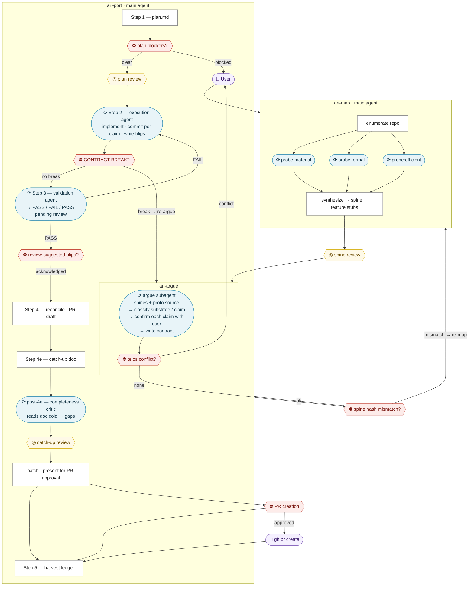

# anima-lite

Argument-preserving feature port toolkit for Claude Code.

Ports a feature from a prototype repo to a production repo while preserving what the feature *argues* — not just what it does. Code is a structure of promises to a user. Translation has to preserve the promises, not just the mechanics.

See `PHILOSOPHY.md` for the core commitments.

---

## The key distinction

**Substrate** — the medium. Library swap, rename, file restructure, styling system. None of these change what the software promises. Translate freely.

**Claim** — the argument itself. Dropping a confirmation step, relaxing a validation, changing reversible to permanent, removing a gate. These change what the user relies on. Always confirmed explicitly, one at a time, never bundled.

When unsure: ask whether a user who understood the feature's promise would notice a difference in the promise. If yes — claim.

---

## Three skills

**`/ari-map`** — probe a repo and write a four-cause spine (material, formal, efficient, final). Run once for each repo in the port pair. Must be current before anything else runs.

**`/ari-argue`** — read both spines plus the feature, identify what it's arguing, classify every implementation detail as substrate or claim, and confirm claim changes with the user one at a time. Produces a branch-scoped contract.

**`/ari-port`** — four steps: plan → execute → validate → reconcile (+ harvest). Translates substrate freely, implements confirmed claims exactly, logs everything else as a blip. Halts back to ari-argue if the contract is actively contradicted by the real code.

---

## Execution flow



| Shape | Meaning |
|---|---|
| White rectangle | Main agent step |
| Blue rounded | Subagent (clean context, isolated) |
| Red diamond `⛔` | Required human gate — pipeline halts |
| Yellow diamond `◎` | Optional human gate — user can inspect or skip |
| Purple | User action |

**Required gates (6):** telos conflict · spine hash mismatch · plan blockers · CONTRACT-BREAK · review-suggested blips · PR creation

**Optional gates (3):** spine review (first-time repos) · plan review · catch-up doc review

---

## Artifacts

```
.anima-lite/
  spine-proto/              # four-cause spine of the prototype repo
    telos.md                # coding-agent entry point; commit-pinned
    material.md             # tech stack + dependencies
    formal.md               # architecture patterns + seam protocols
    efficient.md            # build/CI/deploy
  spine-prod/               # four-cause spine of the production repo
    (same structure)
  features/                 # feature ledger — stubs created by ari-map, enriched by ari-port
    <slug>.md               # stub:0–3; not traced on unconfirmed fields
  contracts/<branch>.md     # feature contract; frozen for session; branch-scoped
  plans/<branch>.md         # execution plan; written before any code moves
  blips/<branch>.md         # translation log with contracting-failure self-audit
  pr-<branch>.md            # PR description draft
  catchup-<branch>.md       # catch-up briefing for reviewer or review agent
```

Spines and feature ledger are committed — shared repo-level state. Contracts, blips, plans, PR drafts, and catch-up docs are gitignored — session artifacts.

Spine refresh collisions across branches surface as merge conflicts. That's intentional: two diverging mental models of the same repo should conflict explicitly.

---

## Running a port

```
/ari-map    path: ../proto-repo,          label: proto
/ari-map    path: ../../prod-repo,        label: prod
/ari-argue  feature: path/to/feature/dir
/ari-port
```

Invoke from the anima-lite root. Both target repos must be on disk. Spines must be current (commit hash in `telos.md` matches HEAD of the target repo) before ari-argue runs.
