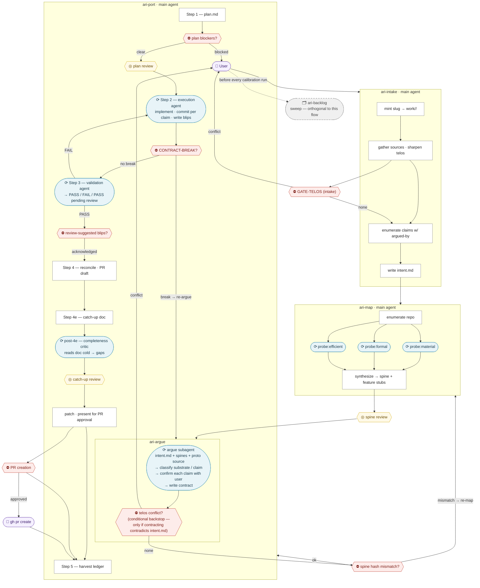

# anima-lite

anima-lite is the custodian of the alignment between what a codebase promises and what it actually is.

Porting a feature from a prototype repo to a production repo — preserving what the feature *argues*, not just what it does — is the first work-type this custody takes, and currently the only one fully built. Code is a structure of promises to a user. Translation has to preserve the promises, not just the mechanics.

See `PHILOSOPHY.md` for the core commitments, including the diagnosis layer and the divergence framing that widen this identity beyond porting — both ratified direction, not yet built.

---

## Map

Facts about this toolkit each live in exactly one place. If you're looking for:

- **Gate registry, spec-ownership map, enforcement levels, doc-ownership map** → `HARNESS.md`
- **Run procedure, commit policy, target-repo paths** → `CLAUDE.md`
- **Core commitments (substrate/claim cut, four causes, conservative default)** → `PHILOSOPHY.md`
- **What each skill does, its inputs/preconditions/output format** → `.claude/skills/<name>/SKILL.md`

This README carries the workflow narrative and diagram below; it doesn't restate facts that live in those files.

---

## The key distinction

**Substrate** — the medium. Library swap, rename, file restructure, styling system. None of these change what the software promises. Translate freely.

**Claim** — the argument itself. Dropping a confirmation step, relaxing a validation, changing reversible to permanent, removing a gate. These change what the user relies on. Always confirmed explicitly, one at a time, never bundled.

When unsure: ask whether a user who understood the feature's promise would notice a difference in the promise. If yes — claim.

---

## Five skills

**`/ari-intake`** — sharpen the work item's telos and ensure everything it asks for is argued for, either by prototype (the proto feature's code carries the argument) or by language derived from context (tickets, meetings, specs, an operator's own translation). Mints the workstream slug and writes the argued-intent artifact, `work/<slug>/intent.md`. Runs first, upstream of `/ari-map` and `/ari-argue` — nothing enters the pipeline unargued.

**`/ari-map`** — probe a repo and write a four-cause spine (material, formal, efficient, final). Run once for each repo in the port pair. Must be current before anything else runs. The spine is itself the durable asset — docs provably current against code — not just fuel consumed by one port; continuous, incremental spine maintenance (update-on-change) is ratified direction, not yet built. Today the spine refreshes on demand, per ari-map's own preconditions.

**`/ari-argue`** — read the argued-intent artifact from `/ari-intake`, both spines, and the feature, classify every implementation detail as substrate or claim, and confirm claim changes with the user one at a time. Produces a branch-scoped contract. Refuses any claim that reaches it without an `argued-by:` line — that goes back to intake.

**`/ari-port`** — four steps: plan → execute → validate → reconcile (+ harvest). Translates substrate freely, implements confirmed claims exactly, logs everything else as a blip. Halts back to ari-argue if the contract is actively contradicted by the real code.

**`/ari-backlog`** — capture and sweep `.anima-lite/backlog.md`, a two-speed pin system for captured-but-not-yet-scheduled work. Runs before every calibration run. This is orthogonal to the per-port flow below, not a step inside it — it doesn't sit between ari-map/ari-argue/ari-port, it brackets the whole pipeline.

Full detail on each — inputs, preconditions, output format — lives in that skill's `SKILL.md`, not here.

---

## Why four causes?

The four causes aren't four independent probes concatenated into a spine — they're a progressively sharper understanding of the same system, each presupposing the previous. The full narrative (what each cause tells you, and why final cause is the frame that makes the other three legible) is canonical in `PHILOSOPHY.md`. The short version: without knowing the telos, you can't sort substrate from claim, because you don't know what a change would be relative to.

---

## Execution flow

`ari-backlog` isn't drawn into the pipeline below — it runs orthogonally, swept before every calibration run rather than as a step between map/argue/port.



| Shape | Meaning |
|---|---|
| White rectangle | Main agent step |
| Blue rounded | Subagent (clean context, isolated) |
| Red diamond `⛔` | Required human gate — pipeline halts |
| Yellow diamond `◎` | Optional human gate — user can inspect or skip |
| Dashed grey | Orthogonal — runs on its own cadence, not a pipeline step |
| Purple | User action |

Full gate registry (IDs, owning skill, trigger, what clears it) and enforcement-level tagging — see `HARNESS.md` §1 and §3.

---

## Artifacts

Per-slug port artifacts live at `.anima-lite/work/<slug>/{intent,contract,blips,plan,catchup,pr}.md`. Spine directories live at `.anima-lite/spine-<label>/{telos,material,formal,efficient}.md`. The exact file formats are owned by the skill that writes them (intent format: ari-intake; spine format: ari-map; contract format: ari-argue; blip format: ari-port) and indexed in `HARNESS.md` §2 — not restated here. (Directory-noun rename: `ports/<slug>/` became `work/<slug>/` 2026-07-07 per vocab decision 2b; see `HARNESS.md` §4. `intent.md` added 2026-07-07, PIN-27 — the workstream now starts at `/ari-intake`, which mints the slug.)

The metrics system under `.anima-lite/metrics/` (run rows, backlog-health rows, session-cost rows, `summary.md`) and the `SessionEnd` cost hook (`.claude/hooks/session-cost.py`) also exist — spec owned by `.claude/skills/ari-port/metrics-spec.md`.

Spine refresh collisions across branches surface as merge conflicts. That's intentional: two diverging mental models of the same repo should conflict explicitly.

---

## Running a port

```
/ari-intake feature: path/to/feature/dir
/ari-map    path: ../proto-repo,          label: proto
/ari-map    path: ../../prod-repo,        label: prod
/ari-argue  feature: path/to/feature/dir
/ari-port
```

Invoke from the anima-lite root. Both target repos must be on disk. `/ari-intake` mints the workstream slug and writes `work/<slug>/intent.md` first. Spines must be current (commit hash in `telos.md` matches HEAD of the target repo) before ari-argue runs, and `intent.md` must exist before ari-argue runs.

Run `/ari-backlog` before every calibration run — see `CLAUDE.md` and `.claude/skills/ari-backlog/SKILL.md`.
